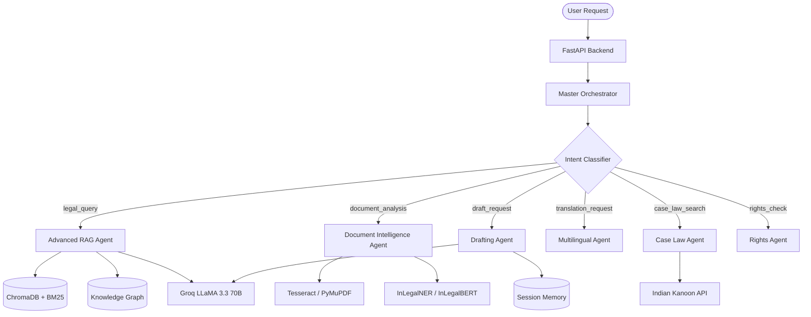

# LexShield AI 🏛️
### Agentic Indian Legal Intelligence Platform

<p align="center">
  
  
  
  
  
  
</p>

---

## The Problem

India has **50+ million pending court cases**. Most citizens cannot afford a lawyer. Legal documents are written in language ordinary people do not understand. When someone's landlord illegally withholds their deposit, their employer steals their wages, or they face a false case — they have nowhere to turn.

Existing tools fail in every way that matters:
- Search engines return PDFs no one can read
- Generic AI chatbots hallucinate section numbers and punishments
- No tool understands scanned Indian legal documents
- No tool is aware of jurisdiction-specific state laws
- No multilingual support for regional languages

---

## Table of Contents

- [The Problem](#the-problem)
- [Overview](#overview)
- [Features](#features)
- [Architecture](#architecture)
- [Tech Stack](#tech-stack)
- [Prerequisites](#prerequisites)
- [Installation](#installation)
- [Configuration](#configuration)
- [Usage](#usage)
- [API Reference](#api-reference)
- [Project Structure](#project-structure)
- [Running Tests](#running-tests)
- [Deployment](#deployment)
- [Contributing](#contributing)
- [Security](#security)
- [Changelog / Roadmap](#changelog--roadmap)
- [License](#license)
- [Acknowledgements / Credits](#acknowledgements--credits)

---

## Overview

LexShield AI is an end-to-end legal empowerment platform serving common citizens who face a regional language barrier and the inaccessibility of legal help amidst India's 50 million pending court cases. It solves the critical problem of legal illiteracy by providing immediate, reliable, and accessible legal guidance. 

The system can transform a scanned document photograph into a cited legal explanation in Malayalam—or other supported languages—in under 60 seconds. The platform uses a specialized multi-agent workflow (LangGraph), advanced RAG with hybrid search and CRAG self-correction, and document intelligence (OCR, NLP, NER) to demystify Indian laws. 

LexShield AI is specifically optimized to run entirely on consumer-grade hardware (CPU-only inference) utilizing free-tier APIs, ensuring zero-cost operations for public empowerment.

---

## Features

### Core Capabilities
* **Advanced RAG Pipeline**: Multi-hop decomposition, CRAG self-correction, era-aware synthesizers (IPC vs BNS), and knowledge graph enrichment.
* **Document Intelligence**: Deep analysis of uploaded documents via Tesseract OCR, PyMuPDF, and custom NER/classifiers to assess risk and detect rights violations.
* **Stateful Drafting Agent**: Human-in-the-loop multi-turn guided flow that drafts legal complaints across 8 distinct categories.
* **Case Law Search**: Live integration with Indian Kanoon to retrieve real precedent and summaries.
* **Rights Module**: Static and dynamic lookups to educate users on Tenant, Employee, Consumer, Women, and Bail rights.

### Multilingual Support
* **5 Supported Languages**: English, Malayalam, Hindi, Tamil, and Telugu.
* **Seamless Translation**: Translates queries into English for retrieval and translates responses back to the native tongue while strictly preserving legal entity names in English.

---

## Architecture

LexShield uses a **Central Orchestrator and Specialized Agents** pattern. The Master Orchestrator intercepts requests and utilizes a LangGraph `StateGraph` to conditionally route execution to the appropriate specialized node based on intent.



---

## Tech Stack

| Layer | Technology | Purpose |
|---|---|---|
| **Backend** | FastAPI + Uvicorn | High-performance async REST API server |
| **Agent Framework** | LangGraph | Stateful multi-agent workflow orchestration |
| **LLM Primary** | Groq LLaMA 3.3 70B | Fast inference for general reasoning and RAG |
| **LLM Fallback** | Gemini 2.0 Flash | Redundant LLM for fault tolerance |
| **Embeddings** | sentence-transformers | `all-MiniLM-L6-v2` for CPU-optimized semantic queries |
| **Legal NLP** | InLegalBERT / InLegalNER | Legal embeddings, doc classification, and NER |
| **Vector Database**| ChromaDB / BM25 | Hybrid search (sparse and dense retrieval) |
| **Reranker** | NVIDIA NIM | Precision ranking of retrieved legal context |
| **OCR & Vision** | Tesseract / OpenCV / PyMuPDF| Extraction from scanned documents and PDFs |
| **Session Memory** | SQLite | Persistent multi-turn chat and graph state checkpointer |
| **Observability** | LangSmith | Execution tracing, latency, and token monitoring |
| **Frontend** | React 18 + Vite | Fast, responsive single-page user interface |

---

## Prerequisites

* **Python**: `≥ 3.10`
* **Node.js**: `≥ 18.x`
* **Tesseract OCR**: Installed on your system with English, Malayalam (`mal`), and Hindi (`hin`) language packs.
* **Poppler**: Required by `pdf2image`.

---

## Installation

```bash
# 1. Clone the repository
git clone https://github.com/anantha037/lexshield-ai.git
cd lexshield-ai

# 2. Setup Python Backend Environment
python -m venv venv
# Windows
venv\Scripts\activate
# Linux/Mac
source venv/bin/activate

# 3. Install Python Dependencies
pip install --no-cache-dir -r requirements.txt

# 4. Setup Frontend Environment
cd frontend
npm install
cd ..
```

---

## Configuration

LexShield AI relies heavily on external APIs. Create a `.env` file in the root directory by copying the example:

```bash
cp .env.example .env
```

### Environment Variables

| Variable | Required | Default | Description |
|---|---|---|---|
| `GROQ_API_KEY` | Yes | - | Primary LLM (LLaMA 3.3 70B via Groq) |
| `GEMINI_API_KEY` | Yes | - | Primary for DraftingAgent, Fallback for RAG |
| `NVIDIA_API_KEY` | No | - | Optional, for Reranking via NIM |
| `INDIANKANOON_API_KEY` | No | - | Required for real-time Case Law searches |
| `ENABLE_CASE_LAW_ENRICHMENT`| No | `true` | Set `false` to skip Case Law calls entirely |
| `LANGCHAIN_TRACING_V2` | No | `false` | Enable to `true` for LangSmith tracing |
| `LANGCHAIN_API_KEY` | No | - | LangSmith trace key |
| `LANGCHAIN_PROJECT` | No | `lexshield-ai` | LangSmith project name |
| `JWT_SECRET_KEY` | Yes | - | Secure 32-char string for Auth tokens |
| `ALLOWED_ORIGINS` | No | `http://localhost:3000,...` | CORS origins |

---

## Usage

### Running Locally

To run the application locally, you'll need two terminal windows:

**Terminal 1: Start Backend (FastAPI)**
```bash
# Ensure virtual environment is active
uvicorn api.main:app --reload --port 8000
```

**Terminal 2: Start Frontend (React/Vite)**
```bash
cd frontend
npm run dev
```

Navigate your browser to `http://localhost:5173`.

---

## API Reference

The backend exposes over 20 endpoints for various capabilities. Swagger documentation is available natively at `http://localhost:8000/docs` when the server is running.

### Key Endpoints

* `GET /health` — Check system health, DB counts, LLM pings, and tracing status.
* `POST /auth/login` — Generate JWT tokens.
* `POST /orchestrator/chat` — Main agentic entry point. Expects JSON `{ "query": "..." }`.
* `POST /document/analyze` — Upload PDF/Images for OCR and NLP analysis (multipart/form-data).
* `POST /legal/query` — Direct access to the RAG pipeline.

Authentication via Bearer token is handled across protected routes.

---

## Project Structure

```text
lexshield-ai/
├── agents/           # LangGraph workflows, nodes, intent routers, and agents
├── api/              # FastAPI entry points, CORS, routers (auth, document, etc.)
├── cv/               # Computer Vision pipelines (OCR, PDF layout analysis)
├── data/             # Vector stores, SQLite memory DBs, Graph JSONs, raw text
├── evals/            # Custom RAGAS pipeline and evaluation tools
├── frontend/         # React SPA (Vite)
├── logs/             # System and execution logs
├── models/           # Custom NLP classifiers and Risk Scorers
├── nlp/              # NER pipelines and entity extractors
├── rag/              # CRAG, Embedders, Vector DB handlers, Synthesizers
├── tests/            # Pytest suite and automated evaluations
├── docker-compose.yml# Container orchestration config
├── Dockerfile        # Python application build script
└── requirements.txt  # Python pip dependencies
```

---

## Running Tests

LexShield AI employs a custom test suite checking the vector store, DB memory, graph execution, and agent relevance logic.

```bash
# Run all tests using pytest
pytest

# Run a specific test file
pytest tests/test_relevance.py

# Run RAG evaluation framework specifically
python tests/run_evals.py
```

---

## Deployment

LexShield AI is containerized for easy deployment.

```bash
# Build and run using Docker Compose
docker-compose up --build -d
```

### Docker Services
* `api`: Builds the FastAPI application mapped to port `8000`.
* `chromadb`: Maps a persistent ChromaDB instance mapped to port `8001`, volume-mounted to `./data/chroma`.

---

## Contributing

1. Fork the repository
2. Clone your fork: `git clone https://github.com/your-username/lexshield-ai.git`
3. Create a feature branch (`git checkout -b feature/amazing-feature`)
4. Commit your changes (`git commit -m 'Add amazing feature'`)
5. Push to the branch (`git push origin feature/amazing-feature`)
6. Open a Pull Request

---

## Security

* **Authentication**: Endpoints are secured via JSON Web Tokens (JWT) using `bcrypt` for password hashing. JWT secrets must be rotated in production.
* **Reporting Vulnerabilities**: Please open a confidential GitHub issue if you spot a vulnerability or email the maintainer directly.
* **Caveat**: The system heavily depends on LLM generations which can occasionally hallucinate. Generated outputs should be treated as guidance and not strict legal counsel.

---

## Changelog / Roadmap

### Current Version (1.0.0)
* Implemented MasterOrchestrator and IntentClassifier
* Advanced RAG pipeline with CRAG, NVIDIA Reranking, and Era-Aware synthesis (IPC -> BNS)
* Stateful drafting agent for 8 local complaint types
* Local execution optimizations (CPU-only sentence-transformers)

### Roadmap
* [ ] Integrate Whisper for Voice input/output.
* [ ] Implement GPU-powered LayoutLM for advanced document layout parsing.
* [ ] Transition from local SQLite session memory to Redis for scale.
* [ ] Expand knowledge graph mapped relationships.

---

## License

*No specific license file was found in the repository.* Please contact the repository owner for permissions regarding commercial use or redistribution.

---

## Acknowledgements / Credits

* Designed and built by **Anantha Krishnan K**, CS Graduate, Hansraj College, University of Delhi.
* **law-ai**: For providing the incredible `InLegalBERT` and `InLegalNER` models.
* **Indian Kanoon**: For providing the open legal API for case law precedent.
* **LangChain & LangGraph**: For providing the core agentic framework and tracing (LangSmith).
* **Groq**: For fast, free-tier LLaMA inference.
